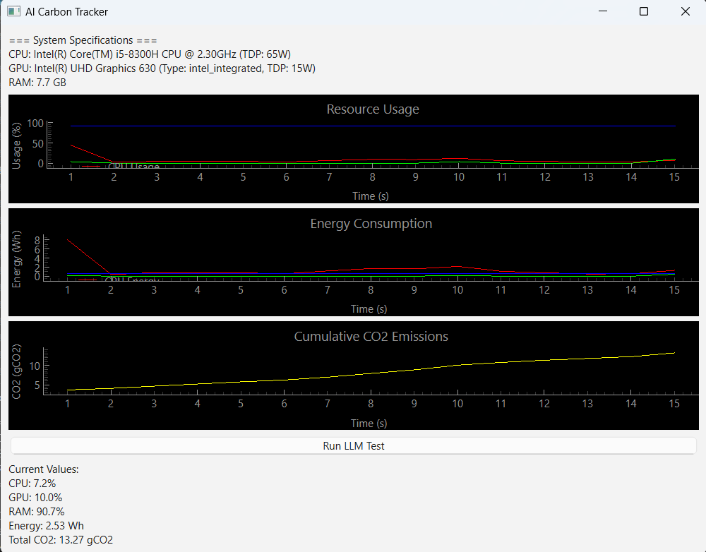

# AI Carbon Footprint Tracker 🌱

A real-time monitoring tool that tracks and visualizes the environmental impact of running AI models, focusing on CPU, GPU, and RAM usage along with their associated energy consumption and CO2 emissions.

 <!-- You might want to add a screenshot here -->

## 🌟 Key Features

- **Hardware Detection**
  - Automatic detection of CPU, GPU, and RAM specifications
  - Support for NVIDIA, AMD, and Intel integrated GPUs
  - Cross-platform compatibility (Windows, Linux, macOS)

- **Real-time Monitoring**
  - CPU utilization tracking
  - GPU usage monitoring
  - RAM consumption measurement
  - Power consumption estimation
  - CO2 emissions calculation

- **Interactive GUI**
  - Live resource usage graphs
  - Energy consumption visualization
  - Cumulative CO2 emissions tracking
  - Real-time metrics display

- **LLM Integration**
  - Built-in Ollama LLM testing capability
  - Environmental impact measurement for AI inference

## 📋 Prerequisites

- Python 3.8+
- Ollama (optional, for LLM testing)

## 🔧 Installation

1. Clone the repository:
   ```bash
   git clone https://github.com/yourusername/ai-carbon-tracker.git
   ```

2. Install the required packages:
   ```bash
   pip install -r requirements.txt
   ```

3. Run the script:
   ```bash
   python gpu_cpu_co2.py
   ```

